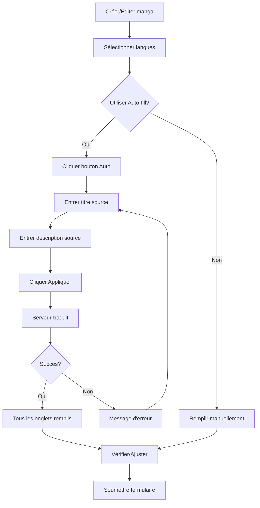

# Guide d'utilisation : Auto-fill des titres et descriptions multilingues

## 📖 Vue d'ensemble

La fonctionnalité **Auto-fill** permet de traduire automatiquement les titres et descriptions de vos mangas dans toutes les langues sélectionnées en un seul clic, en utilisant un serveur de traduction.

## 🎯 Fonctionnalités

### ✨ Traduction automatique
- Traduit simultanément dans toutes les langues sélectionnées
- Utilise un serveur de traduction externe
- Remplit automatiquement tous les onglets de langues
- Gain de temps considérable pour le contenu multilingue

### 🌍 Support multilingue
- Supporte jusqu'à 10 langues :
  - 🇩🇪 Allemand (de)
  - 🇬🇧 Anglais (en)
  - 🇪🇸 Espagnol (es)
  - 🇫🇷 Français (fr)
  - 🇮🇳 Hindi (hi)
  - 🇮🇩 Indonésien (id)
  - 🇯🇵 Japonais (ja)
  - 🇰🇷 Coréen (ko)
  - 🇻🇳 Vietnamien (vi)
  - 🇨🇳 Chinois (zh)

## 📱 Interface utilisateur

### Bouton Auto
Le bouton **Auto** apparaît à côté du badge de complétion :
```
Titres et Descriptions * | [50% traduit] [✨ Auto]
```

- **Icône** : ✨ Sparkles
- **Position** : En haut à droite des champs de titre/description
- **Style** : Dégradé violet avec effet hover
- **État** : Actif uniquement quand `showAutoFill={true}`

### Modal de traduction

Le modal contient :
1. **Titre source** : Champ texte pour le titre à traduire
2. **Description source** : Textarea pour la description à traduire
3. **Serveur de traduction** : URL du serveur (pré-rempli)
4. **Langues cibles** : Affichage des langues sélectionnées avec drapeaux
5. **Boutons** :
   - Annuler : Ferme le modal sans action
   - Appliquer : Lance la traduction

## 🔧 Utilisation

### Étape par étape

1. **Sélectionner les langues**
   ```
   Cliquez sur les drapeaux pour sélectionner les langues cibles
   (jusqu'à 9 langues maximum)
   ```

2. **Ouvrir le modal Auto-fill**
   ```
   Cliquez sur le bouton [✨ Auto]
   ```

3. **Entrer le contenu source**
   ```
   - Titre : Entrez le titre à traduire
   - Description : Entrez la description à traduire (optionnel)
   ```

4. **Configurer le serveur** (optionnel)
   ```
   Par défaut : https://vtranslate.clidey.com/api/translate
   Vous pouvez modifier l'URL si nécessaire
   ```

5. **Lancer la traduction**
   ```
   Cliquez sur [✨ Appliquer]
   Un loader s'affiche pendant la traduction
   ```

6. **Vérifier les résultats**
   ```
   Les onglets de langues sont automatiquement remplis
   Le badge de complétion se met à jour
   Une notification de succès s'affiche
   ```

## 💻 Exemple de code

### Activation dans MangaTitlesField

```tsx
<I18nContentFields
  title={i18nContent.title || {}}
  description={i18nContent.description || {}}
  onTitleChange={handleTitleChange}
  onDescriptionChange={handleDescriptionChange}
  titleRequired={required}
  descriptionRequired={false}
  supportedLanguages={selectedLanguages}
  showAutoFill={true}  // ← Active le bouton Auto
/>
```

### Format de requête API

```json
POST https://vtranslate.clidey.com/api/translate
{
  "title": "Mon manga incroyable",
  "description": "Une histoire épique...",
  "i18n": ["en", "es", "de", "ja"]
}
```

### Format de réponse attendu

```json
[
  {
    "i18_language": "en",
    "title": "My amazing manga",
    "description": "An epic story..."
  },
  {
    "i18_language": "es",
    "title": "Mi manga increíble",
    "description": "Una historia épica..."
  },
  // ... autres langues
]
```

## ⚙️ Configuration

### Props de I18nContentFields

| Prop | Type | Défaut | Description |
|------|------|---------|-------------|
| `showAutoFill` | `boolean` | `false` | Active/désactive le bouton Auto |
| `title` | `TranslatedText` | - | Titres traduits |
| `description` | `TranslatedText` | - | Descriptions traduites |
| `supportedLanguages` | `string[]` | - | Liste des langues sélectionnées |

### Serveur de traduction

Par défaut : `https://vtranslate.clidey.com/api/translate`

Le serveur peut être modifié dans le modal. Il doit :
- Accepter les requêtes POST
- Supporter le format de requête ci-dessus
- Retourner le format de réponse attendu

## 🎨 États visuels

### Bouton Auto
- **Normal** : Dégradé violet, ombre légère
- **Hover** : Scale 1.05, ombre plus forte
- **Active** : Scale 0.95
- **Disabled** : Grisé (si titre source vide)

### Modal
- **Thème** : Adaptatif (light/dark mode)
- **Position** : Centré
- **Animation** : Fade in/out
- **Backdrop** : Flou avec transparence

### Loader
```
Pendant la traduction :
- Loader global plein écran (z-index 9999)
- Animation de spinner blanc
- Fond semi-transparent noir
- Bouton Appliquer affiche "Traduction..."
```

## 🚨 Gestion des erreurs

### Messages d'erreur

1. **Titre vide**
   ```
   ❌ "Please enter a title"
   Le bouton Appliquer est désactivé
   ```

2. **Erreur serveur**
   ```
   ❌ "Auto-fill failed: [message d'erreur]"
   Affiche le message d'erreur du serveur
   ```

3. **Erreur réseau**
   ```
   ❌ "Auto-fill failed: Network error"
   Vérifiez votre connexion internet
   ```

### Récupération
- Les données existantes ne sont pas modifiées en cas d'erreur
- Le modal reste ouvert pour correction
- Le loader se masque automatiquement

## ✅ Messages de succès

```
✨ "Auto-fill successful!"
- Toast vert en haut à droite
- Modal se ferme automatiquement
- Champs vidés pour prochain usage
- Données appliquées aux onglets
```

## 📊 Indicateurs de progression

### Badge de complétion
```
[0% traduit]   → Gris  (aucune langue remplie)
[50% traduit]  → Jaune (certaines langues remplies)
[100% traduit] → Vert  (toutes les langues remplies)
```

### Onglets de langues
- **Non rempli** : Fond blanc/gris
- **Rempli** : Badge ✓ vert visible
- **Sélectionné** : Fond bleu

### Indicateurs en bas
```
[🇬🇧 EN ✓] [🇫🇷 FR ✓] [🇪🇸 ES] [🇩🇪 DE]
     ↓           ↓        ↓        ↓
   rempli     rempli    vide    vide
```

## 🔄 Workflow complet



## 💡 Astuces

### Performance
- Limitez le nombre de langues pour des traductions plus rapides
- Utilisez une description concise pour de meilleurs résultats
- Le serveur peut mettre quelques secondes selon le nombre de langues

### Qualité
- Vérifiez toujours les traductions automatiques
- Ajustez manuellement si nécessaire
- Les traductions techniques peuvent nécessiter des corrections

### Productivité
- Utilisez Auto-fill pour le contenu initial
- Affinez manuellement les détails importants
- Sauvegardez régulièrement pendant l'édition

## 🔗 Intégration

### Pages utilisant Auto-fill
1. **UploadMangas** : Création de nouveaux mangas
2. **EditMangasPage** : Édition de mangas existants

### Composants liés
- `I18nContentFields` : Conteneur principal avec Auto-fill
- `MangaTitlesField` : Wrapper avec sélection de langues
- `LanguageSelector` : Sélecteur de langues interactif

## 🎯 Cas d'usage

### Nouveau manga
```
1. Sélectionner 5 langues (EN, FR, ES, DE, JA)
2. Cliquer Auto
3. Entrer titre en français
4. Entrer description en français
5. Appliquer → 5 traductions instantanées
6. Ajuster si nécessaire
7. Sauvegarder
```

### Mise à jour
```
1. Mangas existants avec EN seulement
2. Ajouter 3 nouvelles langues (FR, ES, DE)
3. Cliquer Auto
4. Copier le titre EN existant
5. Appliquer → 3 nouvelles traductions
6. L'anglais reste inchangé
7. Sauvegarder
```

## 🌟 Avantages

- ⚡ **Rapidité** : Traduit en 10 langues en quelques secondes
- 🎯 **Précision** : Serveur de traduction dédié
- 🔄 **Cohérence** : Même qualité pour toutes les langues
- 💪 **Productivité** : Économie de temps considérable
- 🌍 **Accessibilité** : Contenu multilingue facilité

## 📝 Notes techniques

### Dépendances
- `axios` : Requêtes HTTP
- `react-hot-toast` : Notifications
- `framer-motion` : Animations du modal
- `lucide-react` : Icônes (Sparkles, Loader2)

### État interne
```tsx
const [isLoading, setLoading] = useState(false);
const [autoOpen, setAutoOpen] = useState(false);
const [autoTitle, setAutoTitle] = useState("");
const [autoDesc, setAutoDesc] = useState("");
const [server, setServer] = useState(translateServer);
```

### Sécurité
- Validation du titre source (non vide)
- Gestion des erreurs réseau
- Timeout automatique (configurable côté serveur)
- Pas de données sensibles transmises

## 🚀 Évolutions futures

- [ ] Choix du moteur de traduction
- [ ] Cache des traductions
- [ ] Traduction partielle (langues sélectives)
- [ ] Historique des traductions
- [ ] Import/Export de traductions
- [ ] Traduction par lot (plusieurs mangas)

---

**Version** : 1.0  
**Dernière mise à jour** : 2024  
**Statut** : ✅ Production Ready
